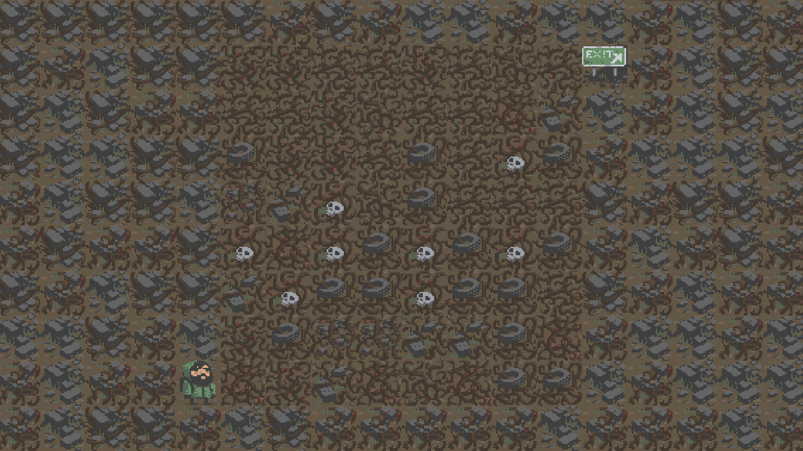

# 一、简介 #

这是我的小学期unity练习作品，总体思路是扫雷和过关型探险游戏（roguelike）结合。思路来源于win10商店扫雷的冒险模式，素材来源于unity官方案例。

# 二、游戏流程介绍 #

## 2.1 启动游戏 ##

游戏已经打包生成于目录下Build文件中，双击Build文件下Mine.exe文件可进入unity默认启动界面；也可以直接在unity中打开此项目。我此次使用的unity版本为Unity 2018.2.1f1 (64-bit)

## 2.2 进入游戏 ##

打开程序后进入开始界面，点击start按钮可以进入难度选择。

难度选择共有三个层级：1级为8 * 8地图10个雷，2级为16 * 16地图40雷，3级为24*24地图99雷。

## 2.3 游戏规则 ##

以1级难度为例。游戏界面如下：

游戏胜利的条件是在不触碰雷的情况下到达出口所在位置（确保一定会有一条通路）

你可以使用wasd键来控制角色的移动。

当游戏角色路过时，没有雷的格子上的障碍会自动摧毁并会在地图上显示周围雷的数量（类似于扫雷）。

如果触碰到雷，游戏将会失败。

在游戏过程中可以使用右键来标记你怀疑是雷的格子。

胜利后会获得分数。分数为地图格数+成功标记的雷的数量。

# 三、总结 #

由于技术以及时间的原因，此游戏尚有许多完善的地方，比如人物模型会卡障碍（偶尔发生，不明白原因）。

欢迎指教。